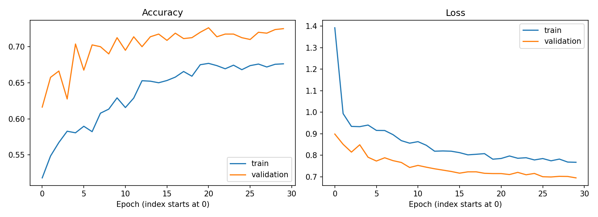
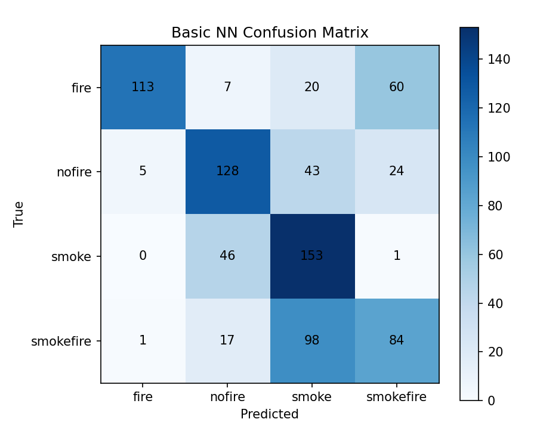
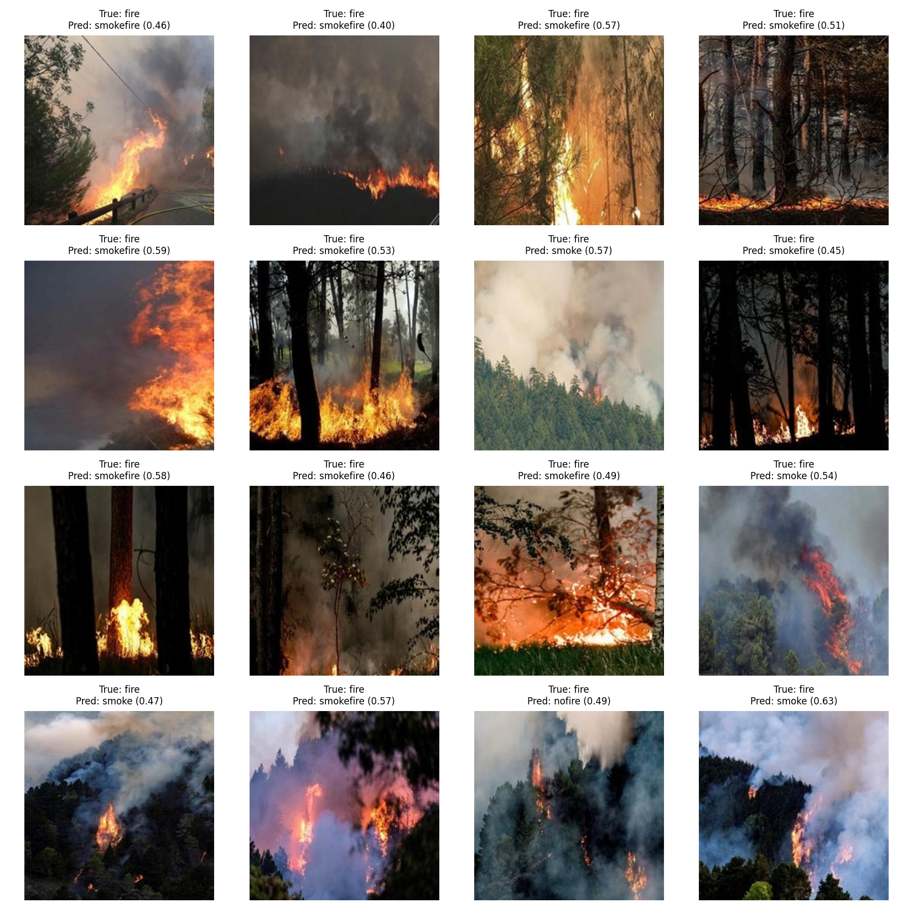

> Tài liệu lịch sử của phiên bản dùng module Python. Code hiện tại đã chuyển sang [các notebook](../../notebooks/01_basic_nn.ipynb); các tham chiếu `src/` bên dưới mô tả phiên bản trước khi chuyển.

# Kết quả chạy Basic Neural Network

Phương pháp và cách chạy: [basic_nn_method.md](basic_nn_method.md).
Số liệu dưới đây được lấy từ CSV và `metrics.json` của checkpoint đang lưu.

## 1. Kết quả test

- Checkpoint: `models/basic_nn_best.keras`; 3,147,012 tham số.
- Số ảnh test: 800.
- Accuracy: **59.750%**.
- Macro F1: **0.6006**; weighted F1: **0.6006**.
- Test loss: **1.072900**; số ảnh sai: **322**.

## 2. Huấn luyện

Đã chạy 30 epochs, checkpoint tốt nhất tại epoch **30** theo validation loss.
Tại epoch đó: train accuracy 67.625%, train loss 0.767295,
validation accuracy 72.500%, validation loss 0.694828.
Cấu hình thực tế của lần chạy được lưu trong `metrics.json`:

```json
{
  "input_size": [
    64,
    64
  ],
  "dense_units": 256,
  "dropout_rate": 0.5,
  "learning_rate": 0.0005,
  "batch_size": 32,
  "epochs": 30,
  "patience": 5,
  "seed": 42,
  "reduce_lr_on_plateau": true
}
```



Train có augmentation và Dropout, val không có; train accuracy thấp hơn val
chưa đủ để kết luận underfitting hoặc overfitting. Cần xem cả loss và đánh giá
train trong chế độ inference trước khi điều chỉnh regularization.

## 3. Từng lớp và confusion matrix

| class | precision | recall | f1-score | support |
| --- | --- | --- | --- | --- |
| fire | 0.9496 | 0.565 | 0.7085 | 200 |
| nofire | 0.6465 | 0.64 | 0.6432 | 200 |
| smoke | 0.4873 | 0.765 | 0.5953 | 200 |
| smokefire | 0.497 | 0.42 | 0.4553 | 200 |

Hàng là nhãn thật, cột là dự đoán:

| true_label | fire | nofire | smoke | smokefire |
| --- | --- | --- | --- | --- |
| fire | 113 | 7 | 20 | 60 |
| nofire | 5 | 128 | 43 | 24 |
| smoke | 0 | 46 | 153 | 1 |
| smokefire | 1 | 17 | 98 | 84 |



## 4. Phân tích lỗi

| Số ảnh | Nhãn thật | Dự đoán |
| --- | --- | --- |
| 98 | smokefire | smoke |
| 60 | fire | smokefire |
| 46 | smoke | nofire |
| 43 | nofire | smoke |

`fire → nofire`: 7 ảnh;
`smokefire → nofire`: 17 ảnh.
F1 thấp nhất ở lớp **smokefire**.
Flatten không khai thác trực tiếp quan hệ không gian giữa các pixel như CNN.



Ảnh minh họa là tối đa 16 lỗi đầu tiên theo thứ tự manifest.
Toàn bộ lỗi và confidence nằm trong `misclassified.csv`.

## 5. So sánh lịch sử

| configuration | min_val_loss | test_accuracy | macro_f1 |
| --- | --- | --- | --- |
| 224x224 baseline | 0.899616 | 0.41 | 0.312299 |
| 64x64 Dense256 Adam0.001 | 0.812424 | 0.55375 | 0.529235 |
| 64x64 additional Dense128 | 0.885081 | 0.4625 | 0.406533 |
| 64x64 Dense256 Adam0.0005 | 0.727488 | 0.58125 | 0.581966 |
| 64x64 Dense256 Adam0.0005 augmentation (selected) | 0.753111 | 0.59375 | 0.596119 |

Bảng này ghi các lần chạy trước khi dọn phiên bản, không tự cập nhật theo lần
train mới. Augmentation đạt test accuracy và Macro F1 cao nhất trong lịch sử;
bản Adam 0.0005 không augmentation có validation loss thấp hơn.
Việc chọn cũ dựa trên test là hồi cứu; không dùng bảng này để tiếp tục tuning.
Các lần cải thiện tiếp theo phải chọn bằng validation, test chỉ dùng báo cáo cuối.
Cần holdout mới để đánh giá độc lập sau lựa chọn lịch sử.

## 6. Kiểm chứng và tệp nguồn

Checkpoint đã được đánh giá lại trên test. Các lần thử huấn luyện và mức
thay đổi accuracy được ghi ở mục tuning bên dưới. Metrics, history, classification
report, confusion matrix và danh sách lỗi là các tệp nguồn trong thư mục này.
Giữ một checkpoint, một file code Basic NN và hai tài liệu phương pháp/kết quả.

## 7. Thử cải thiện cấu hình

Chọn theo validation loss nhỏ nhất, không dùng test để chọn các thử nghiệm.
Các thử nghiệm chỉ thay một yếu tố, giữ seed, split, augmentation và kiến trúc.

| trial | dropout | learning_rate | scheduler | val_loss | val_accuracy | epochs |
| --- | --- | --- | --- | --- | --- | --- |
| current_checkpoint | 0.5 | 0.0005 | False | 0.75204 | 0.69375 | 0 |
| dropout_03 | 0.3 | 0.0005 | False | 0.721856 | 0.71 | 14 |
| lr_0003 | 0.5 | 0.0003 | False | 0.706784 | 0.715 | 30 |
| reduce_lr | 0.5 | 0.0005 | True | 0.694828 | 0.725 | 30 |

Cấu hình được chọn trong lần thử: **reduce_lr**.
Test accuracy trước thử: **56.250%**;
sau chọn bằng validation: **59.750%**.
Chênh lệch: **+3.500 điểm phần trăm**.
Mốc lịch sử trước lần train lại là 59.375%.
Số liệu này thuộc lần tuning đã lưu; các lần train sau có thể khác.
Một seed chưa đủ để kết luận cải thiện ổn định qua nhiều lần chạy.
